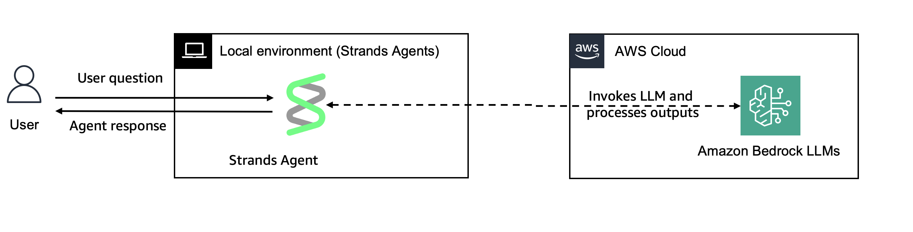

# Getting started with Strands Agents (TypeScript)

Strands Agents is an open source SDK that takes a model-driven approach to building AI agents in just a few lines of code. This quickstart guide will walk you through creating your first agent in TypeScript using large language models to handle planning and tool usage autonomously.


## Prerequisites

- Node.js 18.x or later
- AWS account configured with appropriate permissions
- Basic understanding of TypeScript/JavaScript programming

## Creating Your First Agent



| Feature | Description |
|---------|-------------|
| Agent Structure | Single agent architecture |

The example in `src/firstAgent.ts` demonstrates how to:

- Create a basic agent with Claude Sonnet 4.5 model from Amazon Bedrock
- Configure the agent with a system prompt
- Invoke the agent with a message
- Handle and display the response

## Running the Example

```bash
cd typescript/01-tutorials/01-fundamentals/01-first-agent
npm install
npx tsx src/firstAgent.ts
```


## Additional Resources

- [Strands Agents Documentation](https://strandsagents.com/latest/)


