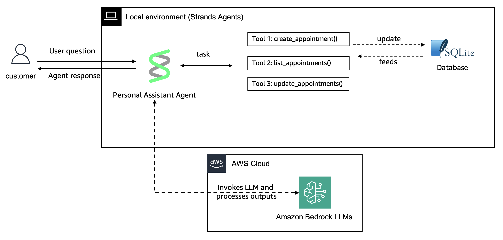

# Adding custom tools to your Strands Agents

## Overview

In this example we will guide you through creating custom tools using the Strands Agents `tool()` function. We will build a personal assistant that connects with a local SQLite database to manage appointments.



| Feature | Description |
|---------|-------------|
| Custom tools created | create_appointment, list_appointments, update_appointment |
| Agent Structure | Single agent architecture |

## Prerequisites

- Node.js 18.x or later
- AWS account with Amazon Bedrock access
- Basic TypeScript knowledge

## Running the Example

```bash
cd typescript/01-tutorials/01-fundamentals/02-custom-tools
npm install
npx tsx src/index.ts
```

## Project Structure

```
src/
├── database/
│   └── AppointmentDatabase.ts    # SQLite data access layer
├── tools/
│   └── AppointmentTools.ts       # Tool definitions factory
└── index.ts                      # Main entry point
```

## Key Concepts

### Class-Based Tool Organization

Tools are organized using a factory class pattern that encapsulates tool creation and database dependencies:

```typescript
export class AppointmentTools {
  constructor(private database: AppointmentDatabase) { }

  getCreateAppointmentTool() {
    return tool({
      name: "create_appointment",
      description: "Create a new personal appointment...",
      inputSchema: z.object({ date, location, title, description }),
      callback: (input) => {
        const id = this.database.createAppointment(...);
        return `Appointment created with ID: ${id}`;
      }
    });
  }

  getAllTools() {
    return [
      this.getCreateAppointmentTool(),
      this.getListAppointmentsTool(),
      this.getUpdateAppointmentTool()
    ];
  }
}
```

### Database Integration

The `AppointmentDatabase` class uses `better-sqlite3` to store appointment information:

```typescript
export class AppointmentDatabase {
  constructor(databasePath: string = "appointments.db") {
    this.db = new Database(databasePath);
    this.initializeTables();
  }

  createAppointment(date, location, title, description): string
  listAppointments(): Appointment[]
  updateAppointment(id, updates): number
}
```

### Agent Configuration

```typescript
const agent = new Agent({
  model: new BedrockModel({
    modelId: "us.anthropic.claude-3-5-haiku-20241022-v1:0",
  }),
  systemPrompt: "You are a helpful personal assistant...",
  tools
});
```

## Additional Resources

- [Strands Agents Documentation](https://strandsagents.com/latest/)
