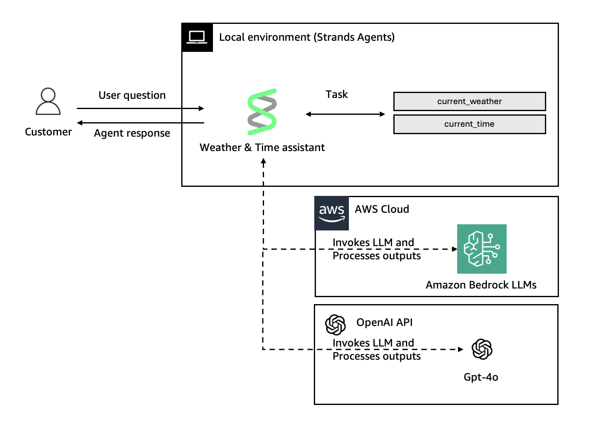

# Model Providers in Strands Agents

This sample demonstrates how to use different model providers (Bedrock and OpenAI) with the Strands Agents SDK, and how to configure model parameters like temperature and maxTokens.

## What This Demo Does



Creates a time & weather assistant that:
- Works with both AWS Bedrock and OpenAI model providers
- Demonstrates model configuration (temperature, maxTokens, modelId)
- Provides simple tools (current time and weather)

## Project Structure

```
src/
├── index.ts      # CLI entry point, conversation loop
└── agent.ts      # Agent configuration with model providers
```

## Model Providers

### Bedrock Model

Uses AWS Bedrock with Claude Sonnet 4.5:

```typescript
import { BedrockModel } from '@strands-agents/sdk';

const bedrockModel = new BedrockModel({
  region: 'us-east-1',
  modelId: 'global.anthropic.claude-sonnet-4-5-20250929-v1:0',
  maxTokens: 1024,
  temperature: 0.7
});
```

**Configuration Options:**
- `region` - AWS region for Bedrock service
- `modelId` - Bedrock model identifier
- `maxTokens` - Maximum tokens to generate
- `temperature` - Controls randomness (0-1)
- `topP` - Nucleus sampling parameter
- `cachePrompt` - Prompt caching strategy
- ...

### OpenAI Model

Uses OpenAI GPT-4o:

```typescript
import { OpenAIModel } from '@strands-agents/sdk/openai';

const openaiModel = new OpenAIModel({
  modelId: 'gpt-4o',
  apiKey: process.env.OPEN_AI_API_KEY,
  temperature: 0.7,
  maxTokens: 1024
});
```

**Configuration Options:**
- `modelId` - OpenAI model identifier (required)
- `apiKey` - OpenAI API key (or use OPENAI_API_KEY env var)
- `maxTokens` - Maximum tokens to generate
- `temperature` - Controls randomness (0-2)
- `topP` - Nucleus sampling parameter
- ...

## Getting Started

### Prerequisites

- Node.js 20+
- AWS credentials (for Bedrock)
- OpenAI API key (for OpenAI)

### Installation

```bash
npm install
```

### Configuration

For Bedrock:
```bash
export AWS_ACCESS_KEY_ID=your_access_key
export AWS_SECRET_ACCESS_KEY=your_secret_key
export AWS_REGION=us-east-1
```

For OpenAI:
```bash
export OPEN_AI_API_KEY=your_openai_api_key
```

### Build

```bash
npm run build
```

### Run

Run with Bedrock (default):
```bash
npm start bedrock
```

Run with OpenAI:
```bash
npm start openai
```

## Testing the Agent

Try these prompts:

1. **Check time**: "What time is it in Paris?"
2. **Check weather**: "What's the weather in London?"
3. **Combined**: "Tell me the time and weather in Tokyo"
4. **Exit**: Type "exit"

The agent will identify itself based on the provider you selected and use the appropriate model to respond.

## Key Takeaways

- Strands Agents supports multiple model providers
- Each provider has its own configuration options
- Model parameters like temperature and maxTokens control generation behavior
- You can switch providers without changing your agent logic
- OpenAI requires separate import: `@strands-agents/sdk/openai`
- Bedrock is exported from main package: `@strands-agents/sdk`
