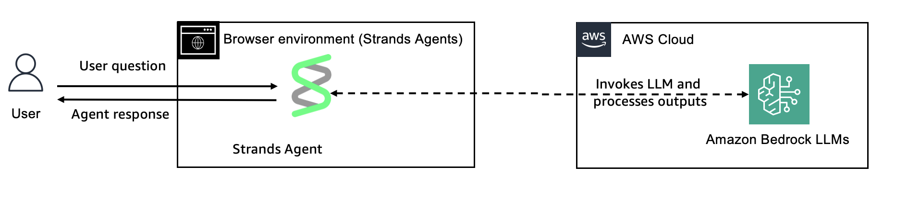
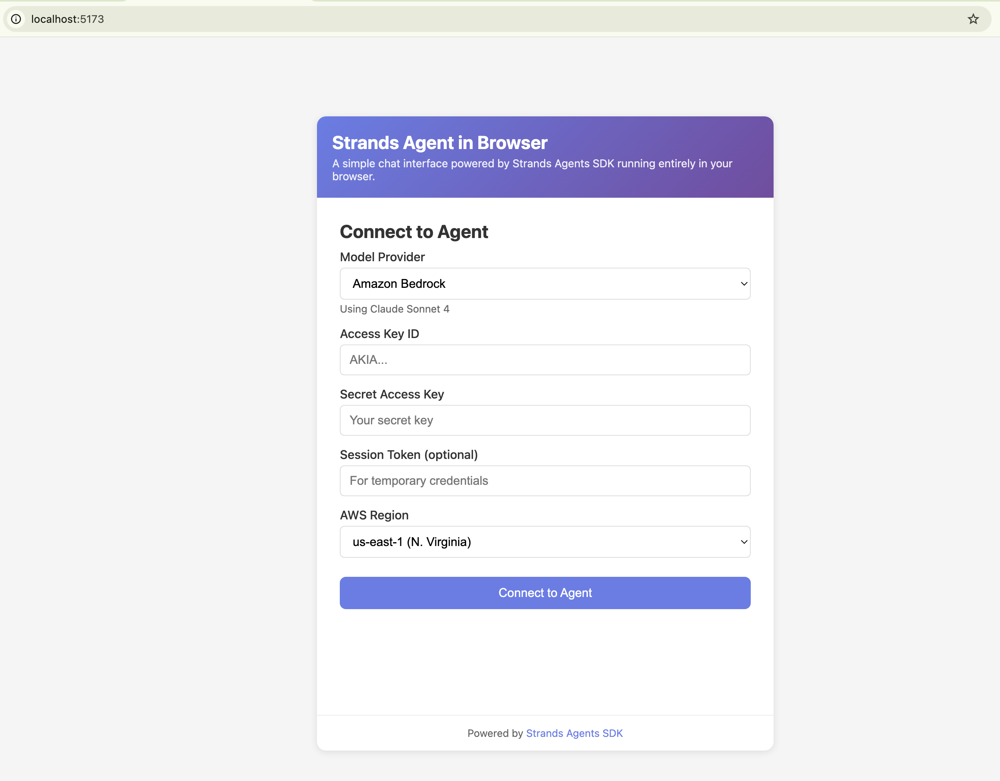
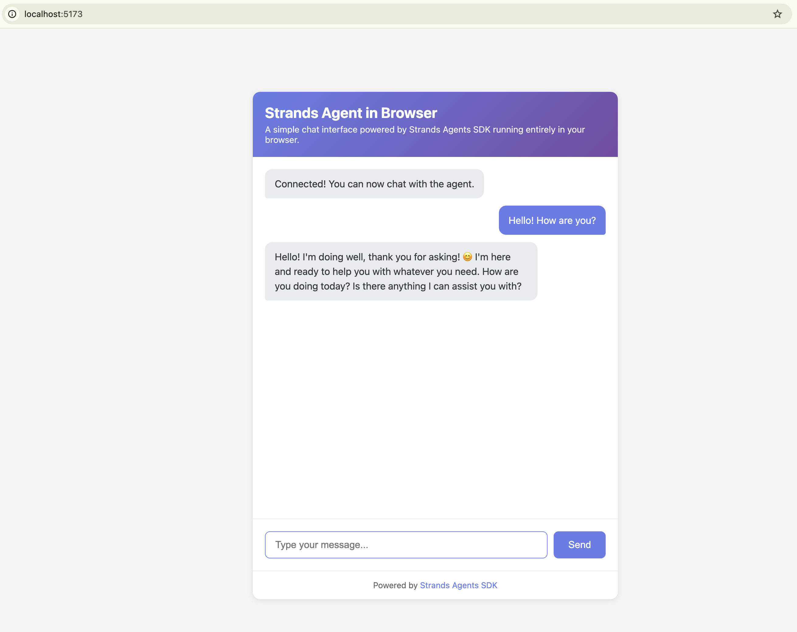

# Running Strands Agents in the Browser

## Overview

This tutorial demonstrates how to run a Strands Agent entirely in the browser using the TypeScript SDK with Vite as the build tool. The example creates a simple chat interface where users can interact with an agent directly from their web browser.



| Feature | Description |
|---------|-------------|
| Agent Structure | Single agent architecture |
| Architecture | Client-side only (browser) |
| Build Tool | Vite |
| Model Providers | Amazon Bedrock (Claude Sonnet 4), OpenAI (GPT-4o) |

## Prerequisites

- Node.js 18.x or later
- One of the following:
  - AWS credentials with Amazon Bedrock access (Access Key ID, Secret Access Key, and optionally Session Token for temporary credentials)
  - OpenAI API key
- Basic TypeScript and web development knowledge

## Project Structure

```
03-browser-agent/
├── images/
│   └── browser_agent.png  # Architecture diagram
├── index.html             # Entry HTML with chat UI
├── src/
│   ├── main.ts           # Agent setup and DOM interaction
│   ├── style.css         # Chat interface styling
│   └── vite-env.d.ts     # Vite type declarations
├── package.json          # Dependencies
├── tsconfig.json         # TypeScript configuration
├── vite.config.ts        # Vite configuration
└── README.md             # This file
```

## Running the Example

```bash
cd typescript/01-tutorials/01-fundamentals/03-browser-agent
npm install
npm run dev
```

This will start the Vite dev server and open `http://localhost:5173` in your browser.



## Key Concepts

### Browser-Based Agent

The agent runs entirely in the browser, which means:

1. **No backend required** - API calls go directly from the browser to the model provider (development only - see Security Considerations)
2. **Simple deployment** - Can be hosted on any static file server (do not bundle credentials)

### Agent Configuration

In browser environments, credentials must be passed explicitly. The application supports two model providers:

#### Amazon Bedrock

```typescript
import { Agent, BedrockModel } from "@strands-agents/sdk";

const agent = new Agent({
  model: new BedrockModel({
    region: "us-east-1",
    clientConfig: {
      credentials: {
        accessKeyId: "...",
        secretAccessKey: "...",
        sessionToken: "...",  // Optional, for temporary credentials
      },
    },
  }),
  systemPrompt: "You are a helpful assistant running in the browser."
});
```


#### OpenAI

```typescript
import { Agent } from "@strands-agents/sdk";
import { OpenAIModel } from "@strands-agents/sdk/openai";

const agent = new Agent({
  model: new OpenAIModel({
    apiKey: "sk-...",
    modelId: "gpt-4o",
    // Required to allow OpenAI SDK to run in browser environments
    clientConfig: {
      dangerouslyAllowBrowser: true,
    },
  }),
  systemPrompt: "You are a helpful assistant running in the browser."
});
```

### Streaming Responses

Streaming displays the response progressively as it's generated, providing immediate feedback:

```typescript
for await (const event of agent.stream(userMessage)) {
  if (
    event.type === "modelContentBlockDeltaEvent" &&
    event.delta.type === "textDelta"
  ) {
    responseText += event.delta.text;
    // Update UI with each chunk
  }
}
```



### Vite

Vite is a build tool that enables browser-based development:

- **TypeScript compilation** - Compiles `.ts` files to JavaScript since browsers can't run TypeScript directly
- **Module bundling** - Resolves and bundles dependencies (like `@strands-agents/sdk`) so browsers can load them
- **Dev server** - Serves files locally with automatic reload on save
- **Production builds** - Creates optimized, minified files for deployment

## Security Considerations

When running agents in the browser, be aware of:

1. **Credentials Exposure** - AWS credentials and OpenAI API keys used in browser code are visible in the network tab and browser developer tools
2. **For Production** - Use a backend proxy or secure token-based authentication
3. **Development Only** - This tutorial is intended for development and demonstration purposes

## Building for Production

```bash
npm run build
```

This creates an optimized build in the `dist/` directory that can be deployed to any static hosting service.

## Additional Resources

- [Strands Agents Documentation](https://strandsagents.com/latest/)
- [Vite Documentation](https://vitejs.dev/)
